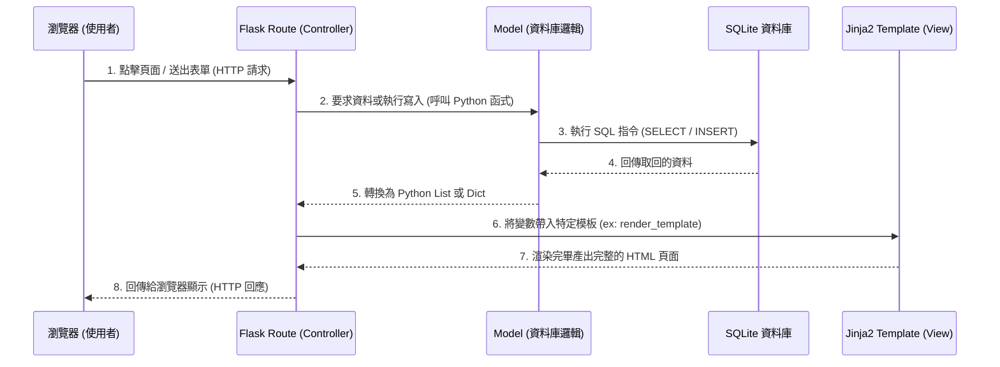

# 食譜收藏夾 系統架構文件 (Architecture)

## 1. 技術架構說明

本專案是一個輕量級的個人食譜管理系統，採用不分離前後端的單體式 (Monolithic) 架構，技術選型如下：

- **後端框架**：**Python Flask**
  - **原因**：Flask 輕巧、靈活，學習曲線平緩，對初學者友善且非常適合個人專案及中小型應用快速開發。
- **視圖/模板引擎**：**Jinja2**
  - **原因**：Flask 內建支援的模板引擎，可將後端傳遞過來的資料無縫渲染至 HTML 頁面中。支援條件判斷、迴圈、區塊繼承等，能輕鬆地建立動態網頁。
- **資料庫**：**SQLite**
  - **原因**：極其輕便的關聯式資料庫引擎，因為檔案直接儲存於本地硬碟中，無需額外安裝或設定獨立的資料庫伺服器（適合「個人使用」規模的食譜系統）。

### MVC 模式對應說明
本專案的架構概念借鑒了 MVC (Model-View-Controller) 設計模式：
- **Model (模型)**：負責定義資料儲存邏輯、存取與修改規則。也就是管理對 Database 的 CRUD (新增/讀取/更新/刪除) 作業。
- **View (視圖)**：負責將資料展現給最終使用者。在此專案中就是採用 Jinja2 語法編寫的 HTML 模板。
- **Controller (控制器)**：系統的神經中樞。在 Flask 裡為「路由」(Routes)，負責接收瀏覽器傳來的 HTTP 請求，向 Model 獲取資料，然後與指定的 View (模板) 結合，並把最終的 HTML 送回給瀏覽器。

---

## 2. 專案資料夾結構

本專案會採用以下資料夾結構，以保持邏輯分割清晰、便於後續擴展或維護：

```text
web_app_development/
├── app/                      # 應用程式主目錄
│   ├── static/               # 存放靜態資源
│   │   ├── css/              # 樣式表 (style.css)
│   │   └── js/               # 客製化腳本
│   ├── templates/            # HTML 網頁模板目錄 (View)
│   │   ├── base.html         # 母版 (定義共用的 Header, Footer, 導覽列)
│   │   ├── index.html        # 首頁 / 食譜總列表頁
│   │   ├── detail.html       # 單一食譜詳細檢視頁
│   │   └── edit.html         # 建立與編輯食譜的表單頁
│   ├── routes/               # 路由與控制器 (Controller)
│   │   └── routes.py         # 食譜相關頁面與操作的路由定義
│   └── models/               # 資料庫操作模組 (Model)
│       └── db_config.py      # SQLite 資料庫初始化與資料表存取函式
├── instance/                 # 本地持久化資料儲存
│   └── database.db           # SQLite 資料庫檔案
├── docs/                     # 專案設計文件
│   ├── PRD.md                # 產品需求文件
│   └── ARCHITECTURE.md       # 系統架構文件 (本文件)
├── app.py                    # 專案的啟動入口 (初始化 app 並匯入路由)
└── requirements.txt          # Python 依賴套件清單 (flask)
```

---

## 3. 元件關係圖

以下展示使用者透過瀏覽器，是如何與 Flask 後端進行互動，最後取得系統中食譜資料的資料流：



---

## 4. 關鍵設計決策

1. **採用一體化伺服器渲染 (Monolithic SSR)**
   因為主要需求聚焦在食譜的 CRUD 上，而且只供單人使用，沒有高度複雜的前端非同步重繪需求。採用傳統前後端不分離的方法（直接在後端生成 HTML 並丟回前端）能讓開發過程更直接且快速，避免跨資源共享 (CORS) 與 API 管理成本。

2. **將資料庫隔離至 `/instance` 目錄**
   把產生的 SQLite `.db` 檔存放在 `instance/` 資料夾，並未來在 `.gitignore` 排除這個路徑。這能確保版控只會備份程式碼，而不會不小心將你私人的食譜資料、或有衝突的 Binary 資料庫檔案上傳到 Git。

3. **路由與模型解耦的分層結構**
   沒有把所有邏輯塞在單一個 `app.py` 裡面，而是將視圖路由 (`routes.py`) 與資料庫打交道的方法 (`db_config.py`) 分開在不同模組內。這樣能保證程式的高可讀性，未來如果要加入如使用者登入或其他複雜功能也容易拓展。

4. **使用 `base.html` 增強版面一致性 (模板繼承)**
   Jinja2 支援模板繼承功能，將共同會用到的表頭、導航列、樣式檔（CSS）設定獨立在 `base.html`。每個分頁只要填入其「專屬區塊」即可，大幅降低 HTML 程式碼重複，未來如果要換網站的顏色主題只要改一個地方。
