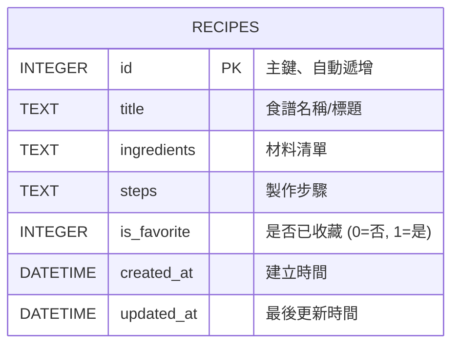

# 系統資料庫設計 (DB_DESIGN)

## 1. 實體關係圖 (ER 圖)

依照我們「食譜收藏夾」的需求，可以將系統設計得非常輕量，目前只需規劃一張 `recipes` 資料表，用於存放所有的食譜狀態與紀錄。

## 2. 資料表詳細說明

### 資料表：`recipes`
負責儲存使用者的所有食譜及相關屬性狀態。

| 欄位名稱 | 型別 | 必填 | 預設值 | 說明 |
| :--- | :--- | :--- | :--- | :--- |
| `id` | INTEGER | 是 | (AUTOINCREMENT) | Primary Key，食譜的唯一識別碼 |
| `title` | TEXT | 是 | - | 食譜的名稱 |
| `ingredients` | TEXT | 是 | - | 食材與份量（可存放含有換行的純文字） |
| `steps` | TEXT | 是 | - | 料理準備步驟與流程說明（可存放含有換行的純文字） |
| `is_favorite` | INTEGER | 否 | `0` | 布林值處理。作為「是否收藏」切換之用 (0 代表未收藏, 1 代表已收藏) |
| `created_at` | DATETIME | 否 | `CURRENT_TIMESTAMP` | 資料建立當下系統寫入的時間 |
| `updated_at` | DATETIME | 否 | `CURRENT_TIMESTAMP` | 更新時壓上的時間戳記 |

## 3. SQL 建表語法

完整的 CREATE TABLE 語法已建置於專案 `database/schema.sql` 中。這能讓應用程式在初次啟動時自動幫我們建立 SQLite 表格。

## 4. Python Model

為方便 Flask Route 操作，我們已將資料庫邏輯封裝在實體的 Python 檔案中：
- `app/models/db_config.py`：負責初始化與 SQLite 的連線及讀取 `schema.sql` 建立表單。
- `app/models/recipe.py`：針對 `recipes` 資料表實作專屬 Model，提供完整 CRUD（獲取單筆、搜尋清單、刪除、編輯、切換收藏）等模組化靜態方法供後續使用。
