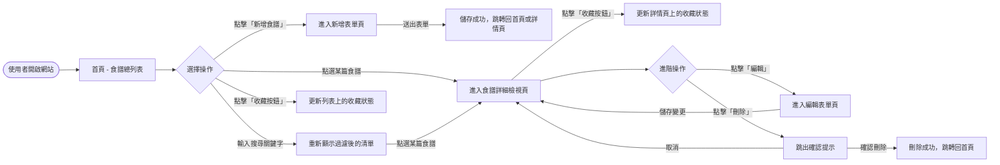
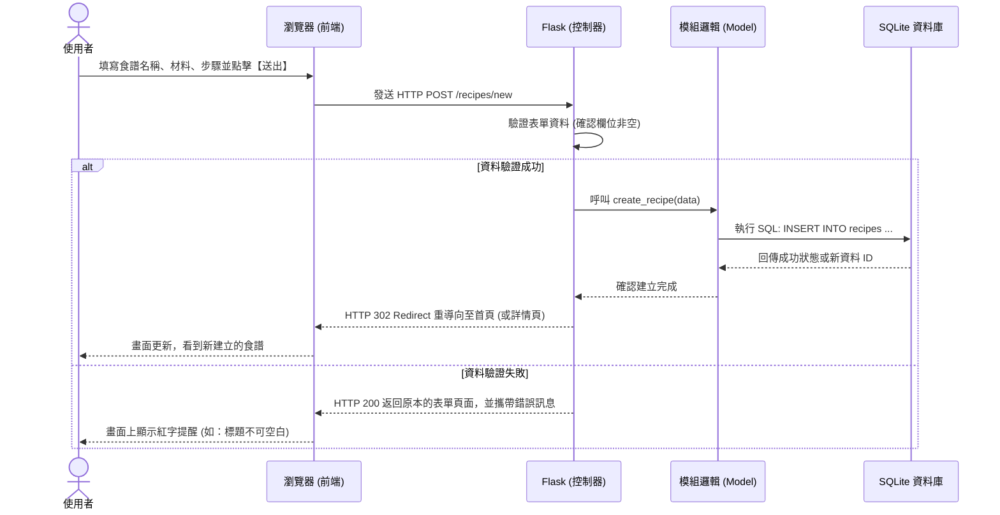

# 食譜收藏夾 流程圖 (Flowcharts)

本文件將展示食譜收藏夾系統的使用者操作動線（User Flow），以及後端資料處理的系統序列圖（Sequence Diagram），並列出未來將要實作的路由對照表。

---

## 1. 使用者流程圖 (User Flow)

描述使用者進入系統後，可以進行的各種操作路徑及畫面流轉：

---

## 2. 系統序列圖 (Sequence Diagram)

以**「新增食譜功能」**為例，描述從使用者送出表單到資料庫寫入的完整資料處理流程：

---

## 3. 功能清單對照表 (Route Map)

在準備進入開發與實作前，我們預先定義出這五大核心功能所對應的 HTTP 方法與路由規則：

| 主要功能 | 網頁操作動作 | HTTP 方法 | URL 路徑 (範例) | 說明 |
| :--- | :--- | :--- | :--- | :--- |
| **瀏覽與搜尋** | 顯示列表/搜尋結果 | GET | `/` 或 `/recipes` | 系統首頁，可透過 `?q=關鍵字` 進行搜尋過濾。 |
| **建立食譜** | 顯示建立表單 | GET | `/recipes/new` | 呈現空白的輸入表單頁面。 |
| **建立食譜** | 儲存新的食譜 | POST | `/recipes/new` | 接收表單內容並將資料寫入 SQLite。 |
| **查看食譜** | 顯示單一詳細內容 | GET | `/recipes/<id>` | 針對特定食譜 ID 取得材料與步驟。 |
| **編輯食譜** | 顯示編輯表單 | GET | `/recipes/<id>/edit` | 呈現包含舊資料的表單頁面。 |
| **編輯食譜** | 更新舊有食譜 | POST | `/recipes/<id>/edit` | 接收修改後的內容並更新至 SQLite。 |
| **刪除食譜** | 執行刪除動作 | POST | `/recipes/<id>/delete` | 刪除特定食譜（為防止 CSRF，實務上常以 POST 取代 DELETE）。|
| **收藏食譜** | 切換收藏狀態 | POST | `/recipes/<id>/favorite` | 將該食譜狀態在「已收藏 / 未收藏」間切換。 |
